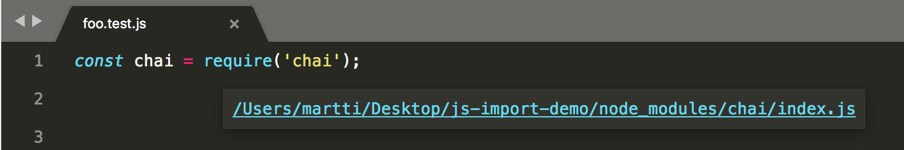
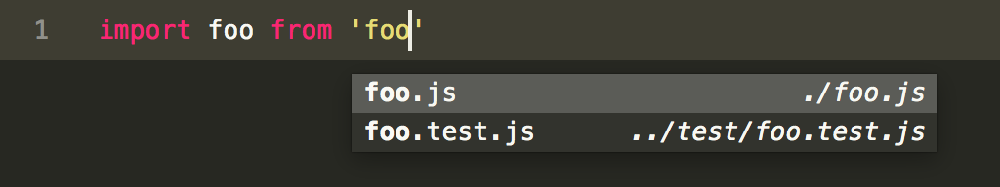
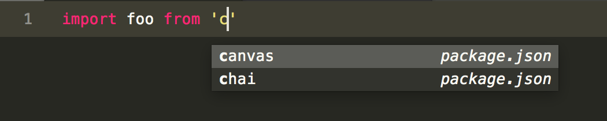

# js-import-resolve (Sublime plugin)

Shows clickable links when hovering js imports (supports `require()` and `import ... from X`).

Works for npm modules and local files. Screenshot:



Also provides autocomplete when typing `require('')` or `import ... from ''`:



Autocomplete also completes NPM module names found in package.json:




## Installation

Clone to your Sublime packages:

```bash
cd ~/Library/Application\ Support/Sublime\ Text\ 3/Packages
git clone git@github.com:codeclown/js-import-resolve.git
```

## License

MIT
